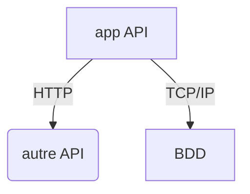
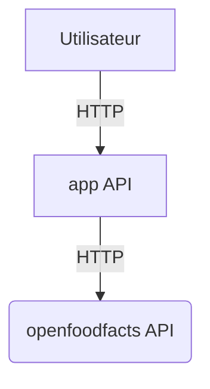

# Consolidation

## Objectif et organisation de la séance  

L'objectif de cette séance est de consolider, en pratiquant, les concepts vus dans les séances précédentes.

Pour cela, vous allez construire une application, en partant de zéro, qui va utiliser les données de l'API [OpenFoodFacts](https://world.openfoodfacts.org/data) afin de déterminer si des produits sont vegan ou non.

Le TP est volontairement bien garni, vous êtes libres d'avancer à votre rythme

## Votre environnement de travail

Pour ce chapitre, vous avez accès à un grand nombre d'environnements pour écrire, versionner et exécuter votre code. Les seuls prérequis sont d'avoir accès à `python`, `pip` et `git`.

Quelques exemples d'environnements pouvant être utilisés :

- Votre machine personnelle
- Un environnement dans le SSPCloud : [Datalab](https://datalab.sspcloud.fr).
- Environnements virtualisés divers. (gitpod et autres ...) 


## Rappels 1 : Mise en place du dépôt Git

:label: Cette partie reprend les concepts du TP1 et TP2

Les instructions ci dessous sont applicables globalement à n'importe quel projet que vous pourriez débuter de zéro.

<details><summary>
Se créer un petit dossier depuis votre repertoire
</summary>
<p>

```
mkdir tp5-ensai
cd tp5-ensai
```

</p>
</details>


<details><summary>Puis initier un dépôt git en créant un fichier README.md</summary>
<p>

```
git init
echo "# TP5-conception-logicielle" > README.md
git add . 
git commit -m "init depot"
git remote add origin <url-https>
git push -u origin --all
```

</p>
</details>

<details><summary>Ajoutez le gitignore disponible ici  : <a href="https://github.com/github/gitignore/blob/master/Python.gitignore">https://github.com/github/gitignore/blob/master/Python.gitignore</a></summary>
<p>

```
curl https://raw.githubusercontent.com/github/gitignore/master/Python.gitignore > .gitignore
git add .gitignore
git commit -m "add gitignore"
git push
```

</p>
</details>


## Rappels 2 :Objectif projet et Dépendances projet


:label: Cette partie reprend les concepts du TP2 et TP3

### Contexte

Comme on vous l'a précisé précedemment, l'objectif du tp est de récuperer et traiter des données sur provenant de l'API [OpenFoodFacts](https://world.openfoodfacts.org/data).

Cela implique assez naturellement de récupérer des dépendances permettant de récupérer des données depuis une api : 

- On proposera pour ce tp d'utiliser la librairie **requests**
https://docs.python-requests.org/en/master/

Et pour la partie exposition des résultats (webservice) : 

- On proposera pour ce tp d'utiliser la librairie fastapi 
https://fastapi.tiangolo.com/ 

=> La documentation précise l'usage d'un serveur 
> You will also need an ASGI server, for production such as Uvicorn or Hypercorn.

- On se propose donc d'utiliser uvicorn 
https://www.uvicorn.org/

<details><summary>Une aide?</summary>
<p>

2 Solutions globalement menant au même résultat: 

- partir d'un environnement python vierge (voir venv ci dessous ) puis : 

```
pip install requests
pip install fastapi
pip install uvicorn
```

Et enfin utiliser la commande :
```
pip freeze > requirements.txt
```
pour sauvegarder les dépendances de l'environnement maintenant plus vierge, dans un fichier de configuration.


- Créer le fichier requirements.txt "à la main", puis installer depuis celui là.  

```
pip install -r requirements.txt
```

> Remarque vous pouvez effectuer tout cela en utilisant les venv vu au tp2

</p>
</details>


## Mise en place de la partie API


:label: Cette partie reprend les concepts du TP3

Comme pour toute dépendance, on vous conseille principalement de vous référer à la documentation officielle : 
https://fastapi.tiangolo.com/ 

Partez directement du fichier **main.py** d'exemple et lancez le avec la commande précisez dans la documentation.

Ajoutez une documentation dans votre README.md sur comment lancer votre code (en français ou en anglais)

Ajoutez cela a votre historique projet 

```
git add . 
git commit -m "mise en place de fastapi"
git push
```

## Exemple de requête sur une api sans authentification 


### Exploration de l'API  


Des documentations de l'API sont disponibles ici : https://wiki.openfoodfacts.org/API  
et ici : https://openfoodfacts.github.io/api-documentation/

- Tester, depuis votre navigateur, la récupération des informations sur un produit :  
https://world.openfoodfacts.org/api/v0/product/3256540001305  
- Bien que le navigateur soit un client HTTP pratique pour naviguer sur le Web, il existe des clients permettant de construire exactement la requête HTTP que vous souhaitez ce qui se révèle très pratique pour des tests un peu plus avancés (par exemple pour l'envoi d'informations au serveur ou pour l'automatisation). Les plus connus sont probablement [Insomnia](https://insomnia.rest/download) et [Postman](https://www.postman.com/downloads/)

### Import de dépendance
Afin de consommer les données depuis Python, il nous faut un client HTTP en Python.  
Pour cette partie on se propose de travailler avec la librairie requests : 

https://docs.python-requests.org/en/master/

Importez la via pip
<details><summary>spoiler</summary><p>

```
pip install requests
# Si vous êtes dans un venv
pip freeze > requirements.txt
# Sinon
pip install pipreqs
pipreqs
```

</p></details>

Cette librairie permet de faire des requêtes http sur des webservices via une api : 

### Mise en pratique

```python=
requete = requests.get("https://world.openfoodfacts.org/api/v0/product/3256540001305.json")
print(requete.status_code)
print(requete.json())
```

Créez une fonction qui récupère les données et les print pour le produit 3256540001305 et ajoutez là à votre endpoint "/"

## Adaptation au besoin

:question: Petit point : L'objectif est de développer une fonction qui permet de savoir si un aliment est vegan ou non en l'ayant récupéré sur l'api : 

> GET sur https://world.openfoodfacts.org/api/v0/product/3033491270864.json

```json
{
  "code": "3033491270864",
  "product": {
    "_id": "3033491270864",
    "code": "3033491270864",
    "ingredients": [
      {
        "id": "en:skimmed-milk",
        "percent_estimate": 75,
        "percent_max": 100,
        "percent_min": 50,
        "rank": 1,
        "text": "Lait écrémé",
        "vegan": "no",
        "vegetarian": "yes"
      },
      {
        "has_sub_ingredients": "yes",
        "id": "en:lactic-ferments",
        "percent_estimate": 25,
        "percent_max": 50,
        "percent_min": 0,
        "rank": 2,
        "text": "ferments lactiques",
        "vegan": "maybe",
        "vegetarian": "yes"
      },
      {
        "id": "en:milk",
        "percent_estimate": 25,
        "percent_max": 50,
        "percent_min": 0,
        "text": "_lait_",
        "vegan": "no",
        "vegetarian": "yes"
      }
    ],
    "ingredients_analysis": {
      "en:non-vegan": [
        "en:skimmed-milk",
        "en:milk"
      ]
    },
}
```

On retrouve l'information de produit vegan ou non dans les balises : `product.ingredients[i].vegan`

qui peut prendre la valeur : 'no' | 'maybe' | 'yes'

Donc après avoir récupéré les données : on peut s'imaginer vouloir développer une fonction qui prend en entrée un tel format de données et renvoie un booléen : 


Dans votre main.py ajoutez la fonction `is_vegan` : 

```python
def is_vegan(ingredients):
    return True
```

Et l'on peut donc bien récupérer les ingrédients de la façon suivante 
```python
def get_ingredients(request_json)
    return request_json["product"]["ingredients"]
```

Avec request_json le json convertit en dictionnaire de la requête GET.

## Paradigmes de programmation

Les paradigmes de programmation sont des styles et pratiques partagées du développement informatique. Elles ne sont pas dépendantes d'un language. Ceux présentés ne sont pas exhaustifs de la réalité des paradigmes, mais sont très couramment rencontrés.
 

### Programmation Objet


La programmation objet étend la programmation impérative : séquence d'instructions desquelles découle les concepts que vous connaissez bien : 

1. Affectation de valeurs
2. Conditions (if*)
3. boucle 

Mais également la programmation procédurale qui introduit les concepts :
1. fonctions
2. modules

De ces 2 paradigmes, l'idée de la programmation objet a été d'étendre les briques de base pour en créer de nouvelles.

On retrouve cela par la construction de classes, qui sont des patrons étendus de type possibles pour le language.

Dans ce TP par exemple, on a un ensemble dont la fonction est d'offrir une interface a la récupération des données de l'API, un ensemble qui traite ces données pour vérifier ce qu'il en est de cette données et un ensemble qui expose toute ces informations pour les rendres accessibles a l'utilisateur.


### Programmation fonctionnelle


La programmation fonctionnelle repose sur l'utilisation de fonctions pour effectuer des traitements plutôt que l'utilisation d'une serie d'instructions impératif.

Elle repose sur plusieurs concepts : 
- La reduction au maximum des effets de bord : utilisation de fonctions pures, immutabilité des paramètres.
- La définition de fonctions pouvant retourner et executer des fonctions, qu'on appelle `fonction d'ordre supérieur`

Ainsi, dans ce cadre, il n'y a plus d'affectation de valeurs déjà existantes. De même que l'on ne bouclera plus ou réalisera plus d'évaluation de condition ligne après ligne, on préferera executer une fonction sur tous les membres d'une liste, qui renverra en fonction un booléen pour vérifier une condition.

En python comme dans beaucoup de languages, les fonctions de base sont:
- La fonction `map` pour appliquer une fonction a un iterable (soit une liste par exemple)

```python
requetes = [{'cle':'valeur1'},{'cle':'valeur2'}]
get_valeur = lambda requete : requete['cle']
valeurs = list(map(get_valeur,requetes)) # ['valeur1', 'valeur2']
```

> Ici la fonction list convertit la map en liste

- La fonction `filter` pour récupérer un sous set d'un iterable en filtrant selon le résultat renvoyé par un prédicat. Ici l'on a rajouté un champ 'class' et l'on veut récupérer seulement les attributs de la requête de type 'A'

```python
requetes = [{'cle':'valeur1', 'class':'A'},{'cle':'valeur2', 'class':'A'},{'cle':'valeur3', 'class':'B'}]
class_is_a = lambda requete : requete['class'] == 'A'
valeurs = list(filter(class_is_a,requetes)) # [{'cle':'valeur1', 'class':'A'},{'cle':'valeur2', 'class':'A'}]

## En contexte on peut les enchainer !
get_valeur = lambda requete : requete['cle']
class_is_a = lambda requete : requete['class'] == 'A'
valeurs = list(map(get_valeur,filter(class_is_a,requetes))) # ['valeur1', 'valeur2']
```

- La fonction reduce permet de réaliser un calcul sur un iterable. Ici par exemple on va évaluer si il existe un élément qui a une valeur `is_vegan` a `false`

```python
from functools import reduce
requetes = [{'cle':'valeur1', 'class':'A','is_vegan':True},{'cle':'valeur2', 'class':'A','is_vegan':True},{'cle':'valeur3', 'class':'B','is_vegan':False}]
is_vegan_reduce = lambda accumulateur,element_itere : accumulateur ==  element_itere['is_vegan']
resultat = reduce(is_vegan_reduce,requetes,True) # False

## En contexte on peut les enchainer !
class_is_a = lambda requete : requete['class'] == 'A'
resultat_avec_filtre = reduce(is_vegan_reduce,filter(class_is_a,requetes),True) # True
```

> Au niveau général, il est d'usage de manier les différents paradigmes en fonction des usages et besoins.

##  Layering - Séparation en couches

Un principe assez crucial dans la construction du code est de séparer les différents composants en fonction de ce qu'ils font.

> Cela permet d'isoler les dépendances dans des modules qui sont cohérents, et donc de permettre de construire une application en `arbre`.

Dans un contexte simple, on distingue 3 couches :
- Une couche de présentation, a partir de laquelle on peut accéder au système. Elle importe seulement les modules exposés par la couche `model`, ces modules sont appelés `service`. Cette couche peut avoir différents noms `web` `view`... On choisira `controller` pour ce TP (c'est spécifique a un Webservice)
- Une couche `model`, dans laquelle est développée tout ce qui est spécifique a l'applicatif. Cette couche peut avoir différent noms `business` `core` .. On choisira `model` pour ce TP.
- Une couche d'accès au données, ou `Persistence Layer`. C'est une couche qui est utilisée par les composants `service`. Cette couche peut avoir différent noms, on prendra `dao` pour ce TP.

Cela implique donc une structure du dépôt de la forme:
```console
README.md
.gitignore
app/
app/requirements.txt
app/main.py
app/model/
app/model/utils.py
app/model/openfoodfacts_service.py
app/controller/
app/controller/application_router.py
app/dao/
app/dao/openfoodfacts_dao.py
app/tests/
```
## :new: Diagramme d'architecture


Pour une meilleure compréhension d'un applicatif, il est très fréquent d'avoir dans la documentation des dépôts Git d'application qui utilisent des dépendances externes des diagrammes d'architecture.

Cela se modélise assez simplement, une boite = une interface et des flèches indiquant les protocoles entre les différentes parties du système.



> exemple pour une appli client lourd

> Pour information, ce diagramme a été réalisé a l'aide de mermaid js, ce qui lui permet d'être integré dans du markdown as code


## Suite du TP

### Diagramme d'architecture

Réalisez un diagramme d'architecture du système cible
<details><summary>spoiler</summary>
<p>


</p>
</details>

### Découpage en couches 

- Adaptez votre structure de code en séparant votre projet en sous modules et classes.

> Note: Commencez par construire les modules et code python puis regroupez en fonction de l'usage.
> Pour la partie **FASTAPI**, vous êtes invités a utiliser les routers : https://fastapi.tiangolo.com/tutorial/bigger-applications/


### Programmation fonctionnelle

- Adaptez la fonction is_vegan dans le module `utils` du package `model` pour a partir d'un résultat de requête donné en entrée calculer si le produit est vegan.

### Mise au propre

Adaptez le code de votre controller pour que cela soit plus cohérent : 

- Changez la ressource HTTP GET de `/hello-world` à `/product/{barcode}`
- Changez la réponse HTTP du GET `/product/{barcode}` : vers {"isVegan": True} ou {"isVegan": False} en appelant la fonction correspondante.

## Tests unitaires sur vos fonctions d'ajouts
:label: Cette partie reprend les concepts du TP3 - TP4

On va ici réaliser un test unitaire a partir de données préalablement récupérées dans l'API.

id des produits tests exemple :
- [3468570116601](https://world.openfoodfacts.org/api/v0/product/3468570116601.json)
- [3256540001305](https://world.openfoodfacts.org/api/v0/product/3256540001305.json)


### Importer des données 


Une idée quand vous travaillez avec ce genre de données peut être de récupérer un jeu de données minime pour l'intégrer à vos tests:

```python
import json
def load_params_from_json(json_path):
    with open(json_path) as f:
        return json.load(f)
```
Cette fonction permet par exemple de charger en tant que dictionnaire un json qui se trouve dans le "json_path" de votre projet.


Et une fois intégré de commencer a travailler sur vos fonctions depuis ces données de test 
> Cela vous permettra ensuite de faire évoluer vos fonctions tout en respectant les règles d'usage que vous vous étiez fixé en amont.

Vous pouvez maintenant mettre du sens aux tests que vous voulez effectuer:

- Récupérez les données des requêtes précedentes que vous stockerez dans des fichiers .json
- Puis vous pouvez du coup écrire les tests suivants : 

```python=
from model.utils import is_vegan

def load_params_from_json(json_path:str):
    pass

class TestIsVegan(unittest.TestCase):

  def test_rozana_is_vegan_true(self):
    rozana_data=load_params_from_json('rozana.json')
    actual = is_vegan(rozana_data)
    self.assertEqual(actual,True)

  def test_brioche_is_vegan_false(self):
    brioche_data=load_params_from_json('brioche.json')
    actual = is_vegan(brioche_data)
    self.assertEqual(actual,False)
```

> En gros : La rozana c'est vegan, la brioche ce n'est pas vegan

> Pour aller plus loin : tester la fonction côté service en mockant 
## Intégration continue


Reprenez ce qui a été fait au tp précédent pour intégrer les tests en continu sur le projet.

<details><summary>spoiler</summary>
<p>

Créez un fichier : 

.gitlab-ci.yml

```yaml=
tests:
    image: ubuntu:20.04
    script:
    - apt update 
    - apt install -y python3-pip
    - pip3 install -r requirements.txt
    - unittest
```

à la racine du dépot git
</p>
</details>

## Aller plus loin : Programmation concurrente / multithreading

<div style="display: none">
Si l'on devait vérifier une liste de produits, il y aurait une grande partie du temps de traitement qui serait lié a l'appel API. Ce temps est incompressible et donc on a besoin d'attendre autant de fois la réponse que le nombre de produits.

> Pour des raisons de simplicité, les appels a l'api seront `mockés` par l'appel a la fonction sleep(1).

```python
def appel_api(barcode):
  import time
  time.sleep(1)
  return {"product": {"ingredients": [{"vegan": "no"}]}}

barcodes_a_requeter = ["3256540001305","3256540001304","3256540001303"]


valeurs = list(map(lambda barcode : appel_api(barcode=barcode),barcodes_a_requeter))
```
Pour un utilisateur cela nous menerait a un goulot d'étranglement.

Une idée pourrait être de lancer un autre script python depuis notre fonction. Ainsi on traiterait la requête en parallèle.

En définissant la fonction comme asynchrone, et en récupérant tous les rés
