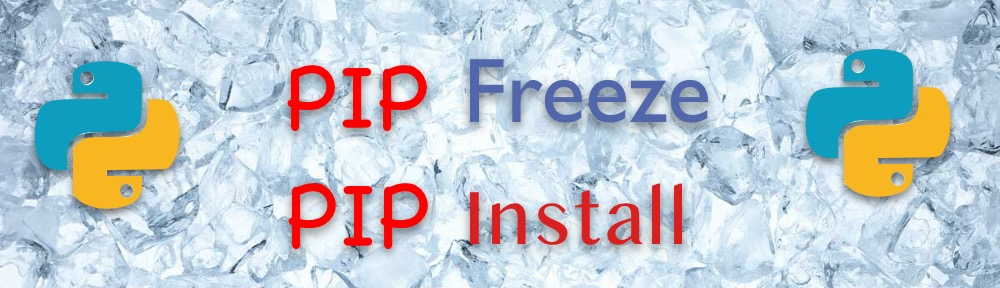

# Portabilité et Configuration

## Approche pédagogique

L'objectif de cette séance est double : il s'agit d'abord de vous sensibiliser à la question de la portabilité des applications et du code puis d'aller plus loin dans l'écriture de code python en développant une application de type "microservice" .

## Votre environnement de travail

Pour ce chapitre, vous avez accès à un grand nombre d'environnements pour exécuter votre code. Le seul prérequis est d'avoir accès à `python` ainsi qu'à `pip`.

Quelques exemples d'environnements pouvant être utilisés :

- Votre machine personnelle
- Un environnement dans le SSPCloud : profitez en pour tester `Che` : https://che.lab.sspcloud.fr/ , une installation du logiciel opensource [Eclipse Che](https://github.com/eclipse/che). Vous avec aussi toujours accès au [Datalab](https://datalab.sspcloud.fr). Le compte à utiliser est le même.
- [Katacoda](https://www.katacoda.com/courses/python/playground) : un bac à sable avec python préinstallé (attention, `python` correspond au binaire `python 2`, utilisez `python3` à la place)

## Organisation de la séance

Cette séance va être beaucoup plus orientée TP que la séance précédente. Vous êtes libres d'avancer à votre rythme, en autonomie. N'hésitez pas à communiquer sur votre avancement et à partager vos questions / problèmes / réussites.

**En lien avec l'objectif de portabilité des applications illustré par cette séance, on se fixe plusieurs règles pour cette séance (règles généralisables à la vie en général)** :

- Un code n'est valide que s'il a été exécuté sur au moins 3 environnements différents.
- Tout le code doit être versionné en permanence sur `git`
- Pour transférer le code d'un environnement à l'autre, on passera par git (`git push` sur un des environnements et `git pull` sur les autres). **Tout transfert de code entre les plateformes en utilisant un autre outil (mail, copier / coller, recopie manuelle ...) doit être proscrit**
- Un code n'est valide que s'il est lançable depuis le terminal (donc sans utiliser les boutons de l'IDE).
- Un code n'est valide que s'il est lançable directement après un `git clone`, éventuellement avec une succession de commandes.
- Un code n'est valide que si la succession de commandes nécessaires au lancement est documentée dans un fichier `README.md` à la racine du projet.

## I) Runtime

Python appartient à la catégorie des langages interprétés (tout comme Javascript et R, par exemple).  
Un langage interprété possède un interpréteur (on parle aussi de `runtime`)
Pour exécuter un code d'un langage interprété, il faut 2 choses :

- Le code source à exécuter
- Un interpréteur (on parle aussi de `runtime`). Pour python, il s'agit de la commande `python` (`python3` sur certains systèmes pour le distinguer de python 2, `python.exe` sur certains systèmes d'exploitation inférieurs)

Pour vérifier que l'interpréteur `python` est bien disponible sur le système, on peut lancer la commande

```
python --version
```

Sidequest : si vous vous demandez où `python` est installé, vous pouvez utiliser la commande `which` (ou `where` pour les systèmes Windows)

> Source + Runtime = chocapics

Il est maintenant temps de lancer notre programme python :

```
python main.py
```

### I) Exercice 1 - fil rouge - Hello all around the world

Exécuter, **en respectant l'ensemble des règles fixées dans la partie `Organisation de la séance`**, un code python affichant `Hello world`.

> Créez un projet TP2-conception-logicielle sur votre forge préférée

## II) Environnement d'execution

### Qu'est ce que pip

**pip** c'est un gestionnaire de paquets pour python

C'est l'installer de premier choix quand il s'agit d'ajouter des dépendances à un projet python.

- Maven/Gradle pour Java
- Npm/Yarn pour Javascript
- ...

### Qu'est ce qu'un gestionnaire de paquets

Lorsque vous voulez travailler avec des fichiers informatiques, les gestionnaires de paquets sont là pour vous.

Ils permettent :

- d'installer/mettre à jour/désinstaller des logiciels/outils/code

<a href="https://pip.pypa.io/en/stable/reference/pip_install/">

```
pip install <package>
```

</a>

<a href="https://pip.pypa.io/en/stable/reference/pip_uninstall/">

```
pip uninstall <package>
```

</a>

> Remarque la commande peut également être pip3 selon votre environnement.

> \+ des petites verifications pour éviter de télécharger les mauvaises dépendances

### Environnements virtuels dans python


Pour une isolation des paquets installés, et ne pas utiliser tout ce qui existe déjà sur un poste, python permet l'utilisation d'environnements virtuels (virtualenv ou venv).

Ils s'installent au travers du module venv ex :

`python3 -m venv ./venv`

> Cela installe un environnement dans le sous dossier ./venv par rapport au terminal executant le module.

> Note: cet environnement ne doit pas être versionné et donc votre gitignore doit bien le gérer.

Une fois mis en place, vous pouvez le lancer en utiliser la commande en fonction de l'OS:

| Environnement | Terminal   | commande                       |
| ------------- | ---------- | ------------------------------ |
| MacOs         | bash       | `source <venv>/bin/activate`   |
| Linux         | bash       | `source <venv>/bin/activate`   |
| Windows       | cmd.exe    | ` <venv>\Scripts\activate.bat` |
| Windows       | powershell | ` <venv>\Scripts\Activate.ps1` |

- 2 moyens de le vérifier :
  - pip list --local (il n'y a pas grand chose)
  - Vous avez maintenant une parenthèse vous indiquant que vous êtes bien dans votre venv

:boom: Attention à ne pas le versionner toutefois, réferez vous au .gitignore du chapitre git pour plus d'informations

:checkered_flag: maintenant vous pouvez mettre en place l'environnement via pip install -r requirements.txt par exemple

### Pip : Canoniser l'environnement d'execution



Pour mieux partager un environnement qui permet de faire tourner le code, pip propose de sanctuariser les dépendances dans un fichier **requirements.txt**. C'est l'équivalent des fichiers `package.json` en Javascript (npm), `pom.xml` (Java / maven) ...

Il permet de le générer en faisant à la racine du projet (note : ce fichier peut aussi être créé / modifié à la main) :

```

pip freeze > requirements.txt

```

Et d'installer toutes les dépendances venant d'un fichier de ce type, encore a la racine

```

pip install -r requirements.txt

```

**Le fichier requirements.txt doit être versionné avec votre code sur git**

> Remarque, pip freeze ne fait que des opérations très basiques (lister l'environnement et le sortir dans un message). Il faut donc soit partir d'un environnement d'abord propre (environnement virtuel puis installation de toutes les dépendances), ou utiliser une autre librairie - par exemple pipreqs

> Lien : https://github.com/bndr/pipreqs

### Exercice 2 : Ajout d'une dépendance - Calcul de distance de Levenshtein avec FuzzyWuzzy

1. Créez un environnement virtuel en local

ex:

```

python -m venv ./venv

```

2. Activer votre environnement virtuel

```

source venv/bin/activate

```

3. Vous pouvez verifier que l'environnement est bien pris en compte de 2 manières :

- pip list --local (il n'y a pas grand chose)
- Vous avez maintenant une parenthèse vous indiquant que vous êtes bien dans votre venv

:boom: Attention à ne pas le versionner toutefois, réferez vous au .gitignore du chapitre git pour plus d'informations

:checkered_flag: maintenant vous pouvez mettre en place l'environnement via pip install -r requirements.txt par exemple

4. Au lieu de renvoyer "hello world", faites en sorte que votre code calcule la distance de Levenshtein entre 2 mots de votre choix. Si vous n'êtes pas inspirés "conception logicielle","portabilité" ça fera l'affaire.

> Nous allons utiliser la librairie FuzzyWuzzy qui permet de calculer la distance de Levenshtein entre 2 mots.

> https://pypi.org/project/fuzzywuzzy/

5. Synchroniser les environnements

Synchronisez maintenant les différents environnements sur lesquels vous travaillez pour valider l'exercice, en respectant les règles !

## Creation d'un package

Les gestionnaires de paquets permettent a la fois d'utiliser des paquets existants, mais vous le devinez bien, il est possible d'en créer vous même.

Les dépots de packets peuvent être :

- privés - c'est le cas dans les entreprises en général
- publics - c'est le cas ici du dépôt pypi https://pypi.org/ , vers lequel pointe par défaut une installation de pip.

L'idée de la création d'un package est de créer une brique réutilisable de composants fonctionnels.

Cela peut être par exemple la réutilisation de classes entre différents projets ou la sauvegarde d'un sous ensemble de fonctions utiles que vous aimez utiliser sur les différents projets sur lesquels vous travaillez.

Un package en python a cette forme

```
projet
├── LICENSE
├── package
│   ├── __init__.py
│   └── t.py
├── README.md
└── setup.py
```

A la racine du package se trouve:

- un fichier setup.py, qui contient des métadonnées sur la version, le nom de l'application, etc..
  => Il s'agit d'un fichier python qui permet ensuite de construire un "livrable" au sens de python, prêt a être envoyé.
- Un fichier LICENSE pour préciser le mode d'usage et de partage du package
- un fichier README pour décrire l'usage

Puis il faut, dans cet ordre :

- construire le livrable (avec un outil comme `buildtools`)
- envoyer le livrable (avec un outil comme `twine`)

> plus d'information / exemple : https://packaging.python.org/en/latest/tutorials/packaging-projects/

> Globalement, c'est faisable mais pas immédiat, et ça dépend de plusieurs sources de configuration.

=> Vous pouvez essayer si vous vous en sentez

## Configuration externe d'un programme

Pour l'execution d'un programme, on est assez souvent amenés a externaliser la configuration :

- Dans le cas de l'accès a une ressource avec un mot de passe, vos mots de passe ne devant pas être versionnés.
- Ce qui dépend de l'environnement cible et qui semble configurable : une _URL de base de données_, un lien vers un jeu de données dans un datalake, un chemin de fichier vers un sous dossier externe a l'application, une règle de gestion comme un seuil d'erreur..

Cela s'effectue de plusieurs manières :

- Soit par la lecture de variables d'environnement.
- Soit par l'injection de paramètres au lancement d'un programme.
- Soit par l'ajout de fichiers de configuration dont l'emplacement est connu et attendu par le programme que l'on lance.

**Ce qui reste le plus préconisé, c'est l'utilisation de variable d'environnement dans l'applicatif (cf https://12factor.net)**

Pour cela de nombreuses librairies existent dans tous les languages, en python nous utiliserons la librairie `python-dotenv` pour la lecture du fichier de configuration de l'application **.env** et l'export des variables dans l'environnement.

```
# Configuration des mots par défaut
DEFAULT_MOT_UN=conception
DEFAULT_MOT_DEUX=configuration
ENVIRONNEMENT=local
```

> exemple d'un fichier .env

```python
from dotenv import load_dotenv

load_dotenv() # Charge toutes les variables du fichier .env dans l'environnement
```

Les variables sont accessibles dans l'environnement, nous utiliserons pour cela la librairie `os` pour accéder a ces données.

```
import os

variables_environnement = os.environ
default_mot_un = variables_environnement['DEFAULT_MOT_UN']
default_mot_deux = variables_environnement['DEFAULT_MOT_DEUX']
```

## Exercice 3: paramétrage et variables d'environnement

Pour cet exercice, l'objectif est de rendre paramétrable sans changer le code, les mots qui seront utilisés pour la comparaison de distance de Levenshtein.

Pour cela:

1. Créez un sous dossier `ratio` dans lequel vous créerez un fichier `ratio.py`. Exportez la partie fonctionnelle du code **"core"**, soit ce qui n'est pas le print dans ce fichier.

2. Depuis votre fichier de départ / `__main__.py` par exemple, importez ce module.

```python
from ratio.ratio import ratio

levenshtein_ratio = ratio()
print(levenshtein_ratio)
```

> ~ **main**.py

Maintenant, il faut que nous fassions 2 choses:

- Créer un fichier de définition de variables d'environnement a charger contenant les variables d'environnement `DEFAULT_MOT_UN` `DEFAULT_MOT_DEUX` `ENVIRONNEMENT`, a la racine de votre projet, puis faite en sorte de charger ce fichier dans l'environnement. **Vous pouvez vous aider de l'exemple plus haut**

- Adapter le code de la fonction ratio() pour qu'elle récupère les variables d'environnement.

<details>
  <summary>Solution</summary>

```python
import os

from fuzzywuzzy import fuzz


def ratio():
    mot_1 = (
        os.environ["DEFAULT_MOT_UN"]
        if "DEFAULT_MOT_UN" in os.environ
        else "conception_logicielle"
    )
    mot_2 = (
        os.environ["DEFAULT_MOT_DEUX"]
        if "DEFAULT_MOT_DEUX" in os.environ
        else "configuration"
    )
    return fuzz.ratio(mot_1, mot_2)
```

</details>

## (Pour aller plus loin) Poetry : une alternative sérieuse simplifiant la gestion des dépendances

> https://github.com/python-poetry/poetry

Projet plus récent, répondant a des besoins d'usage non couverts/ mal couverts par pip.

Plusieurs limites existent dans l'utilisation de pip pour un projet de taille réelle :

- Gestion des conflits dans l'installation de packages
- Praticité de la réalisation de package sur PiPy
- Gestion fine des dépendances pour les environnements d'execution du code (on ne veut pas les dépendances liées au tests par exemple)
- Adhérence non comprise dans pip a l'environnement virtuel

Un fichier unique pour la configuration de votre projet le `pyproject.toml`.

Ici, poetry intègre les notions de versionning, de versions courantes fonctionnelles et crée un lien entre packages et environnement virtuel où l'on execute, ce qui limite naturellement quelques eceuils.

Pour ce qui est du packaging, poetry est un facilitateur dans la mise en place de la configuration pour le déploiement de package. Tout est dans un fichier, mais également tout s'effectue d'un seul coup et avec un seul outil.

### Exercice 4 : Utilisation de poetry et construction d'un package PyPi

Commencez par consulter la documentation `getting started` de Poetry

- Installez poetry sur votre environnement

```
pip install poetry
```

- Configurez votre projet pour utiliser poetry (depuis la racine de votre projet)

soit :

```
poetry init
```

puis

```
poetry install
```

- Créez un compte sur PyPi.org

- Ajoutez les informations de connexion dans la commande suivante

```
poetry config http-basic.pypi <username> <password>
```

- Construisez votre livrable:

```
poetry build
```

- Envoyez votre livrable sur votre dépôt:

```
poetry publish
```

- :tada: Vous pouvez maintenant installer votre package sur un autre poste
